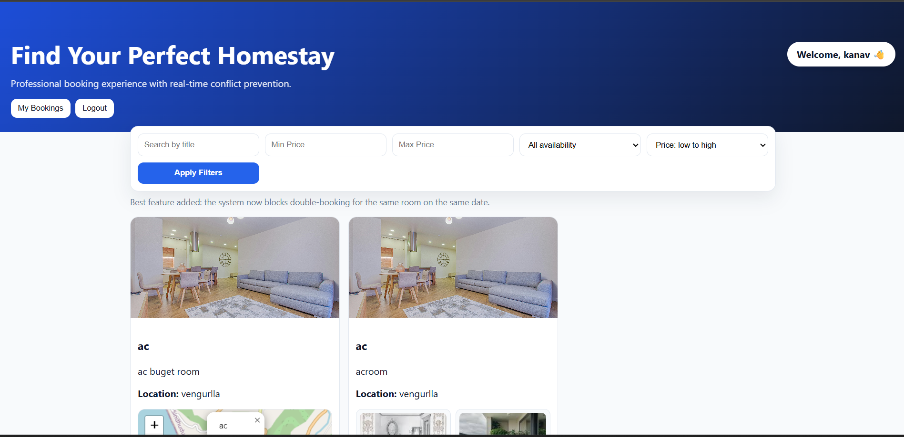
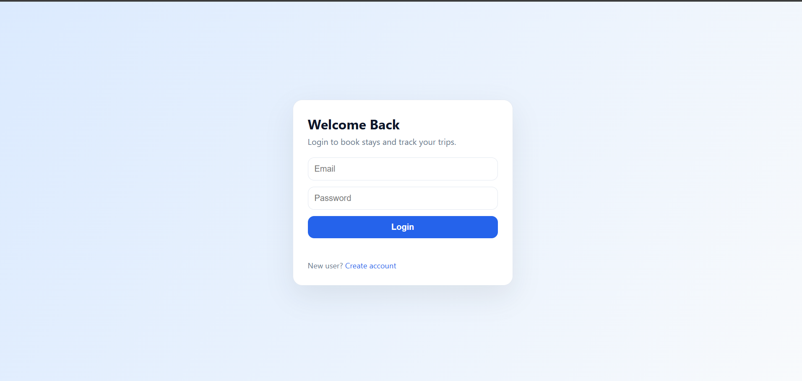

# Homestay Project 🏨

A full-stack Homestay Booking & Service Marketplace platform built using Node.js, Express.js, MySQL, HTML, CSS, and JavaScript.

This project allows users to explore homestays, make bookings, chat with providers, and upload payment proof. Providers and admins can manage bookings through dedicated dashboards.

---

## 🚀 Features

* User Authentication & Authorization
* Provider Dashboard
* Admin Dashboard
* Homestay Listings
* Booking System
* Chat System
* QR Payment Upload
* Payment Verification
* Role-Based Access Control
* Responsive User Interface

---

## 🛠 Tech Stack

### Frontend

* HTML
* CSS
* JavaScript

### Backend

* Node.js
* Express.js

### Database

* MySQL

### Authentication

* Session / JWT Authentication

---

## 📸 Screenshots

### Home Page



### Login Page



### User Dashboard


### Admin Panel


---

## 🔮 Future Improvements

* Online Payment Gateway
* Email & SMS Notifications
* Google Maps Integration
* Reviews & Ratings
* AI-based Recommendations
* Full Deployment on Cloud

---

## 📂 Installation

```bash
git clone https://github.com/Sarveshnabar03/homestay-project.git
cd homestay-project
npm install
npm start
```

---

## 👨‍💻 Author

**Sarvesh Nabar**

GitHub:
https://github.com/Sarveshnabar03
