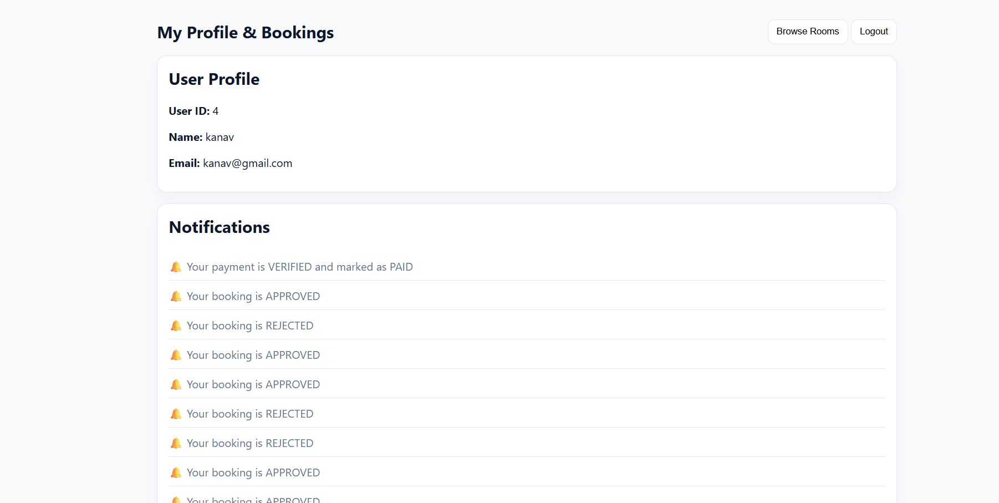
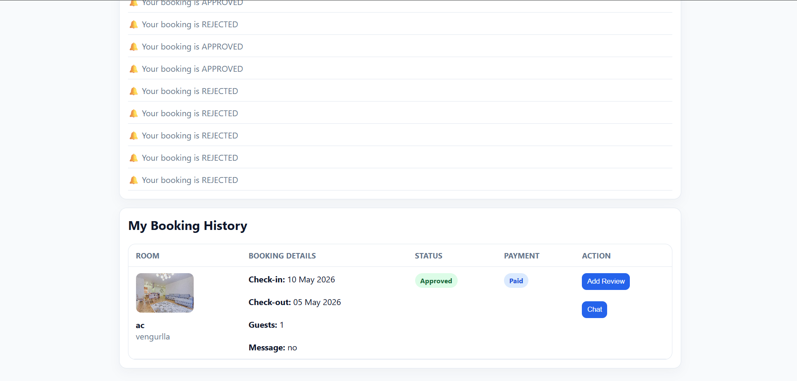
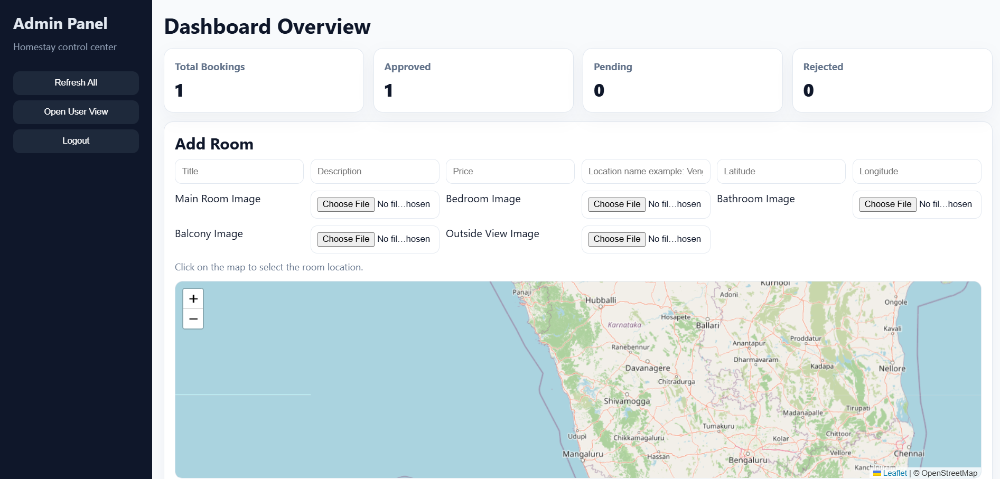
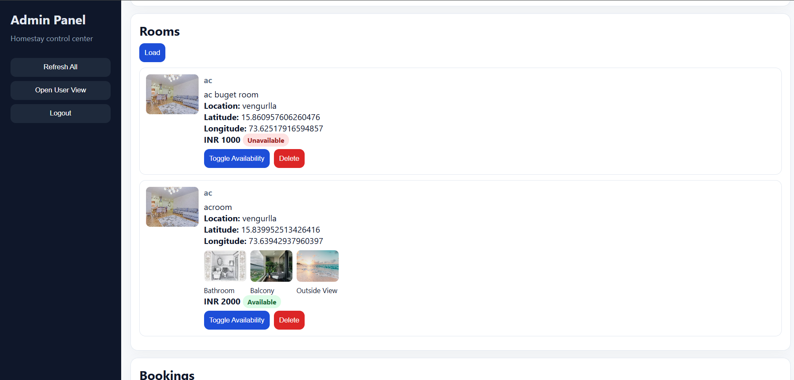
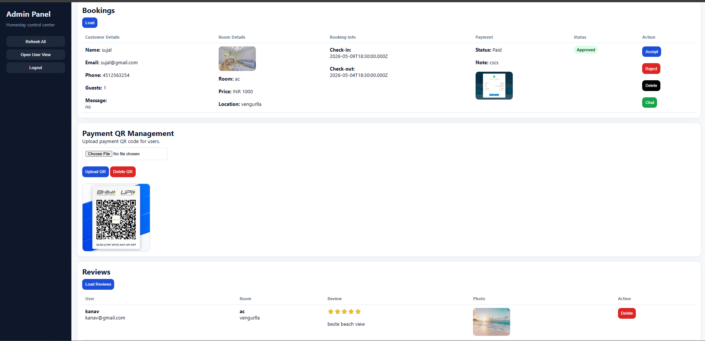
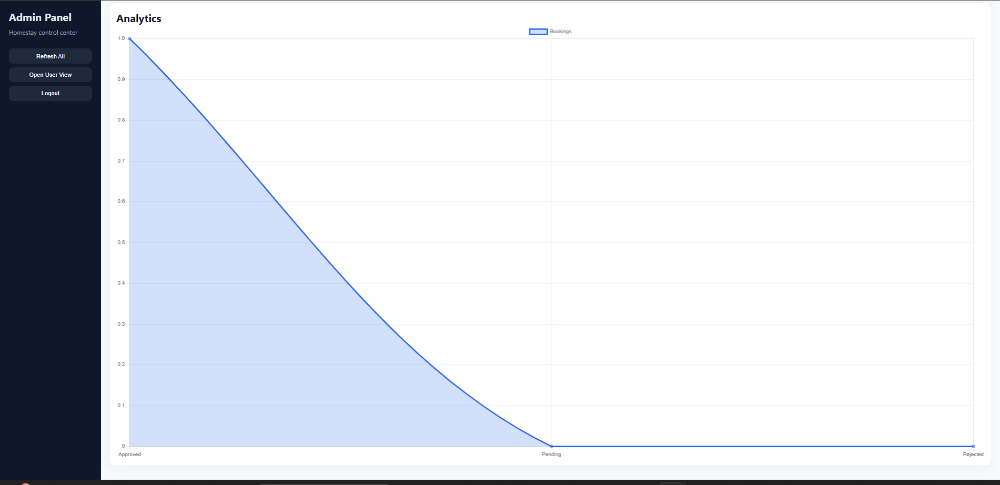

# Homestay Project 🏨

A full-stack Homestay Booking & Service Marketplace platform built using Node.js, Express.js, MySQL, HTML, CSS, and JavaScript.

This project allows users to explore homestays, book stays, chat with providers, upload payment proof, and manage bookings through dedicated dashboards for users, providers, and admins.

---

## 🚀 Features

* User Authentication & Authorization
* Provider Dashboard
* Admin Dashboard
* Homestay Listings
* Booking System
* Chat System
* QR Payment Upload
* Payment Verification
* Role-Based Access Control
* Responsive UI Design

---

## 🛠 Tech Stack

### Frontend

* HTML
* CSS
* JavaScript

### Backend

* Node.js
* Express.js

### Database

* MySQL

### Authentication

* JWT / Session Authentication

---

## 📸 Screenshots

### Login Page

Simple and secure login system for users and providers.


---

### Home Page

Landing page showcasing homestays and platform features.


---

### Profile Page 1

User profile and booking management section.



---

### Profile Page 2

Additional user dashboard functionalities and booking details.



---

### Admin Panel 1

Admin dashboard for managing bookings and providers.



---

### Admin Panel 2

Provider approval and management system.



---

### Admin Panel 3

Booking and payment verification section.



---

### Admin Panel 4

Complete admin control panel overview.



---

## 🔮 Future Improvements

* Online Payment Gateway Integration
* Email & SMS Notifications
* Google Maps Integration
* Reviews & Ratings System
* AI-based Recommendations
* Full Cloud Deployment

---

## 📂 Installation

```bash
git clone https://github.com/Sarveshnabar03/homestay-project.git
cd homestay-project
npm install
npm start
```

---

## 👨‍💻 Author

**Sarvesh Nabar**

GitHub:
https://github.com/Sarveshnabar03
